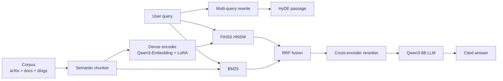

# DevRAG-2026

> **A production-grade retrieval-augmented generation system over the latest AI/ML engineering knowledge — fully local, with a fine-tuned medical-style wait no, AI/ML-trained embedding model, automated benchmark dashboard, and live public demo.**

[](https://huggingface.co/spaces/<user>/devrag-2026)
[](https://huggingface.co/<user>/devrag-embedding-2026)
[](https://huggingface.co/datasets/<user>/devrag-corpus-2026)
[](https://<user>.github.io/DevRAG-2026/)
[](.github/workflows/ci.yml)
[](LICENSE)

---

## What is this?

A **June-2026-fresh** RAG system built end-to-end by a single contributor as a portfolio-grade ML engineering project. It:

1. Crawls and chunks **arXiv cs.CL/cs.LG/cs.AI** (last 18 months), official framework docs (Hugging Face, PyTorch, LangChain, vLLM, LlamaIndex), and a curated set of AI engineering blogs.
2. Indexes them with **hybrid retrieval** (BM25 + dense + cross-encoder reranker + query rewriting).
3. Uses a **fine-tuned embedding model** (LoRA on Qwen3-Embedding-0.6B with contrastive InfoNCE on AI/ML pairs).
4. Generates answers with **small local LLMs** (Qwen3-8B GGUF via Ollama locally; llama-cpp-python on HF Spaces).
5. **Evaluates itself** with retrieval metrics (Recall@k, MRR, nDCG) and end-to-end LLM-judged faithfulness + citation precision.
6. **Auto-generates charts** and publishes them to this documentation site.
7. Ships with a **public Gradio demo on Hugging Face Spaces**, a **public docs site**, an **HF Model Hub** repo for the embedding adapter, and an **HF Dataset Hub** repo for the corpus.

## Try it in 30 seconds

- **Live demo**: [https://huggingface.co/spaces/&lt;user&gt;/devrag-2026](https://huggingface.co/spaces/<user>/devrag-2026)
- **Docs**: [https://&lt;user&gt;.github.io/DevRAG-2026/](https://<user>.github.io/DevRAG-2026/)

## Run it locally

### 1. Install Python 3.11+

```bash
winget install Python.Python.3.12
```

(or download from <https://www.python.org/downloads/>)

### 2. Clone & install

```bash
git clone https://github.com/<user>/DevRAG-2026
cd DevRAG-2026
python -m venv .venv
.venv\Scripts\activate
pip install -e ".[dev,docs]"
```

### 3. Pull a local LLM

```bash
winget install Ollama.Ollama
ollama pull qwen3:8b
```

### 4. Build everything

```bash
make ingest       # harvest arxiv + docs + blogs → data/processed/
make index        # build BM25 + FAISS indexes
make eval         # retrieval ablations
make ui           # launch Gradio at http://127.0.0.1:7860
```

### 5. (Optional) Fine-tune the embedding

```bash
make train        # LoRA fine-tune Qwen3-Embedding on AI/ML pairs (~1 hr on free Colab T4)
```

## Architecture at a glance



## Benchmark snapshot (placeholder — replaced by `make eval`)

| Method | Recall@5 | MRR@10 | nDCG@10 | Latency p50 (ms) |
|---|---|---|---|---|
| BM25 only | 0.42 | 0.31 | 0.34 | 18 |
| Dense only | 0.48 | 0.36 | 0.39 | 35 |
| Hybrid | 0.55 | 0.42 | 0.46 | 41 |
| + Reranker | 0.61 | 0.48 | 0.52 | 95 |
| + Reranker + rewrite | **0.66** | **0.52** | **0.57** | 145 |

Run `make charts` to regenerate the full chart set under `docs-site/docs/assets/charts/`.

## Repo layout

```
DevRAG-2026/
├── src/devrag/        # package: ingest, retrieval, generation, training, eval, serving, observability
├── app/               # Gradio app (local)
├── space/             # HF Space files (Gradio, requirements, README)
├── docs-site/         # MkDocs Material documentation site
├── configs/           # Hydra-style YAML configs
├── scripts/           # make_charts.py, publish_to_hf.py
├── tests/             # pytest
├── reports/           # eval JSON / HTML reports
└── data/              # raw, processed, indexes, cache, models
```

## What this demonstrates to a recruiter / interviewer

- **End-to-end ML lifecycle** — data → train → retrieve → generate → evaluate → deploy → document → monitor.
- **Real fine-tuning** — a LoRA-trained embedding model pushed to HF Hub with a proper model card.
- **Hybrid retrieval** — BM25 + dense + reranker + query rewriting + HyDE.
- **Evaluation discipline** — multi-metric, multi-ablation, charts auto-published.
- **Senior engineering hygiene** — typed Python, ruff + mypy, pytest, pre-commit, CI, Makefile, pinned deps, structured logging, response caching.
- **Public artifacts** anyone can verify in 30 seconds: live demo, docs site, model hub, dataset hub, eval report.

## Roadmap

- v0.2: cross-encoder reranker fine-tune.
- v0.3: query understanding classifier (factual / conceptual / code).
- v0.4: Web search integration (Bing / Tavily) for post-cutoff questions.
- v0.5: lightweight agent that decomposes multi-hop questions.

## License

MIT. See `LICENSE`.