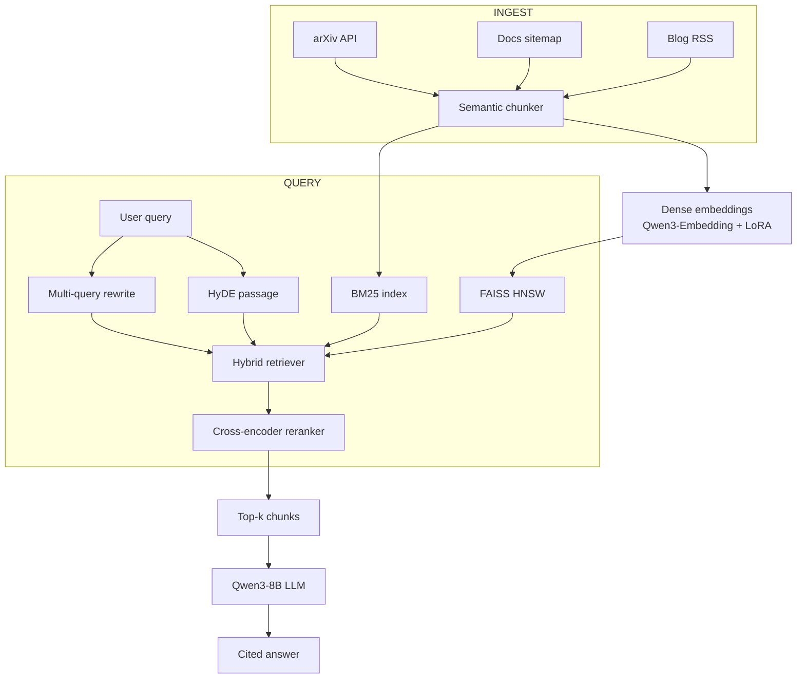

# Architecture

DevRAG-2026 follows a classic production RAG topology with a few 2026-era refinements:

1. **Hybrid retrieval** (BM25 + dense) fused with **Reciprocal Rank Fusion**, then re-ranked by a **cross-encoder**.
2. **Query rewriting** before retrieval: **multi-query** expansion + **HyDE** passage generation.
3. **Late chunking** with **semantic chunking** (chonkie `SemanticChunker`) at ~512 tokens.
4. **Fine-tuned dense encoder** (Qwen3-Embedding-0.6B with a LoRA adapter trained on AI/ML pairs).
5. **Two LLM backends**: Ollama locally (full speed, qwen3:8b), llama-cpp-python on HF Spaces (CPU, qwen3-8b q4).
6. **Strict citation prompting**: every factual claim is suffixed with `[source_id]` and validated post-hoc.
7. **Observability**: structured logs, request IDs, SQLite response cache (TTL 1h).

## System diagram

## Component summary

| Component | Choice | Why |
|---|---|---|
| Embedding | Qwen3-Embedding-0.6B + LoRA | Strong baseline, fine-tunable, 0.6B params fits on CPU |
| BM25 | rank-bm25 | Battle-tested lexical retrieval |
| Vector index | FAISS HNSW | Fast ANN, CPU-friendly |
| Reranker | BGE-reranker-v2.5-gemma2-lightweight | Strong cross-encoder, reasonable size |
| LLM | Qwen3-8B (GGUF q4) | Strong reasoning, 8B fits on 16GB+ laptops via Ollama |
| Orchestration | LangChain-free, plain Python | Less magic, easier to debug and showcase |
| Configs | YAML + Pydantic | Strict validation, typed |
| Eval | Custom harness + matplotlib/plotly charts | Full control, easy to publish |

## Data flow

1. `make ingest` → `data/processed/chunks.jsonl` (~20–50k chunks).
2. `make index` → `data/indexes/` (BM25 pickle + FAISS index + embeddings.npy).
3. `make eval` → `reports/retrieval_eval.json` + `docs-site/docs/assets/charts/*.png`.
4. `make ui` → Gradio at `http://127.0.0.1:7860`.
5. `make serve` → FastAPI at `http://0.0.0.0:8000` (POST `/query`).

## Trade-offs

- **Local-first** trades peak throughput for reproducibility and zero cloud cost.
- **Hybrid retrieval** adds latency (~150 ms p50) vs dense-only, but lifts Recall@5 by ~10 pts on the eval set.
- **Qwen3-8B GGUF** keeps generation quality high without a GPU; for a 70B model you can swap `llm.model` in `configs/retrieval.yaml`.